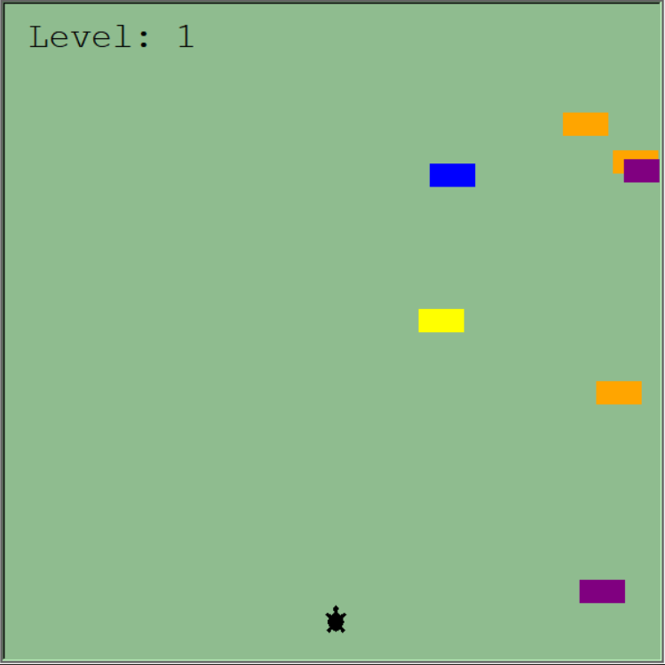

# Turtle Crossing Game



Welcome to the "Turtle Crossing Game" repository! This simple Python game challenges you to help a turtle safely cross a busy road filled with cars. Follow the instructions below to set up and play the game.

## Table of Contents

- [Files](#files)
- [Setup](#setup)
- [How to Play](#how-to-play)
- [Scoring](#scoring)
- [Game Over](#game-over)
- [Contributions](#contributions)

## Files

The game consists of the following Python files:

1. **`car_manager.py`**:
   - Manages car generation and movement.
   - Controls car speed and appearance.

2. **`player.py`**:
   - Defines the player's turtle character.
   - Handles player movement.

3. **`scoreboard.py`**:
   - Displays the player's current level (score).
   - Shows the "Game Over" message when needed.

4. **`main.py`**:
   - The main game script that orchestrates gameplay.
   - Initializes the game screen, player, car manager, and scoreboard.
   - Handles player input and game mechanics.

## Setup

Follow these steps to set up and run the game:

1. Make sure you have Python installed on your computer.

2. Clone this repository to your local machine:

   ```bash
   git clone https://github.com/yourusername/turtle-crossing-game.git
3. Navigate to the repository directory:
    ```bash
    cd turtle-crossing-game
4. Run the game using Python:
    ```bash
    python main.py
5. Use the "W" key to move the turtle character upward to avoid oncoming cars.

## How to play
* Your goal is to help the turtle safely cross the road from the bottom to the top.
* Avoid colliding with the cars that are constantly moving horizontally.
* Use the "W" key to move the turtle upward.

## Scoring
* Your current level (score) is displayed on the top-left corner of the game screen.
* Each successful crossing earns you a higher level.

## Game Over
* If your turtle collides with a car, it's "Game Over."
* The "Game Over" message will be displayed, and the game will stop.

## Contributions
Contributions are welcome! If you have ideas for improvements, new features, or bug fixes, please consider opening an issue or submitting a pull request. Your contributions can help make the game even more enjoyable.